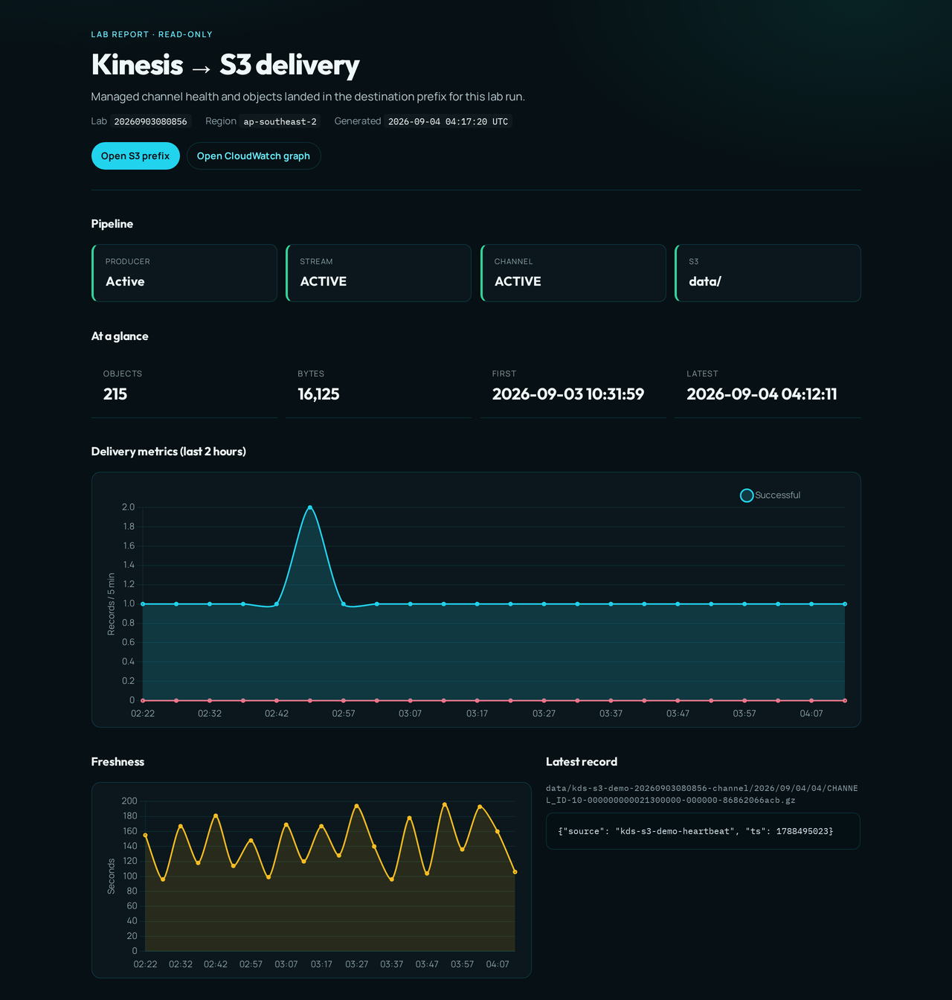
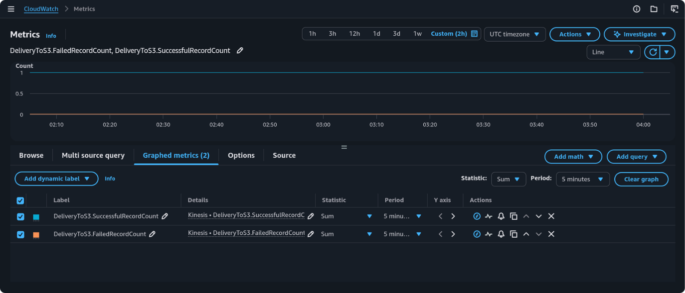

import { Aside, Steps } from "@astrojs/starlight/components";
import Checklist from "@/components/Checklist.astro";

<Checklist
  id="cli-visualize"
  items={[
    "Opened the HTML delivery report (or skipped — lab already complete at Verify in S3)",
  ]}
/>

## Overview

Lab completion is **objects verified in S3**. Visualization is optional.

`demo.sh viz` builds a **self-contained HTML report** (`.lab/viz/report.html`) using the same
site fonts and palette as this walkthrough:

- Pipeline status — producer → stream → channel → S3
- DeliveryToS3 Successful / Failed / Freshness charts (last 2 hours)
- Latest decompressed record and recent object table
- Buttons into the S3 prefix and CloudWatch graph

Read-only AWS CLI calls only (needs `python3` on PATH). Re-run `viz` to refresh.

## Steps

<Steps>

1. Build and open the report:

   ```bash frame="terminal"
   export AWS_PROFILE=sandbox
   export AWS_REGION=ap-southeast-2
   ./scripts/demo.sh viz
   ```

   Looks like:

   ```text
   Building delivery report…

   Report    …/.lab/viz/report.html
   Lab       LAB_SUFFIX
   Bucket    s3://kds-s3-demo-LAB_SUFFIX-ACCOUNT_ID
   Channel   kds-s3-demo-LAB_SUFFIX-channel (CHANNEL_ID)

   Opened in the default browser.
   ```

   The report opens in the browser (pipeline, DeliveryToS3 charts, latest record):

   

2. Use **Open CloudWatch graph** in the report for the interactive console view (same three
   dimensions as Verify in S3). With the heartbeat producer you typically see a steady
   `SuccessfulRecordCount` near one per interval and `FailedRecordCount` at zero:

   

   Re-run `viz` after another freshness window to refresh the local HTML charts.

</Steps>

<Aside type="tip">
  Empty charts usually mean the freshness window has not elapsed yet (default 300 seconds).
</Aside>

## References

- [Monitoring data delivery](https://docs.aws.amazon.com/streams/latest/dev/data-delivery-monitoring.html)
- [S3 general purpose delivery](https://docs.aws.amazon.com/streams/latest/dev/data-delivery-s3.html)
