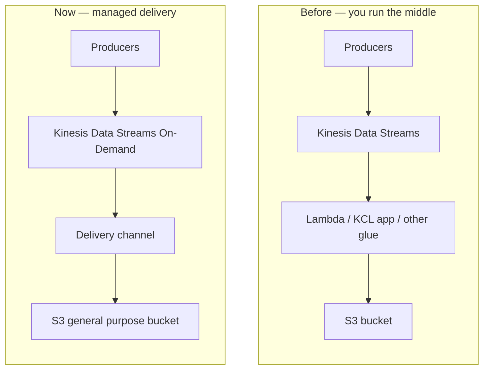

import { Card, CardGrid, Aside } from "@astrojs/starlight/components";
import Tooltip from "@/components/Tooltip.astro";

## Why this exists

Before August 2026, landing raw records from
<Tooltip term="kds" label="Kinesis Data Streams" /> into a general purpose S3
bucket meant building a delivery pipeline yourself — chain more serverless
services, run a consumer application, or operate something in between. You
owned scaling, retries, and the glue.

Managed S3 general purpose delivery removes that middle tier: configure a
<Tooltip term="channel" /> on an On-Demand stream and Kinesis Data Streams
buffers, batches, and writes objects for you. No consumer compute to provision,
and delivery does not consume the stream's read throughput.



| | Before | This lab |
| --- | --- | --- |
| Path to S3 | Stream → consumer or glue → `PutObject` | Stream → channel → S3 |
| Who scales and retries | You | Kinesis Data Streams |
| Stream read impact | Consumer uses shard throughput / EFO | Delivery does not consume read throughput |
| Transform | Whatever you build | Source format only (no transform) |

This page is the pain-point framing only — the lab does not recreate the
self-managed path. Firehose remains a different product when you need its
destinations or conversion features.

## What you will do

<CardGrid>
  <Card title="Create the stream and channel" icon="rocket">
    On-Demand <Tooltip term="kds" label="Kinesis Data Streams" /> plus a
    <Tooltip term="channel" /> that writes to a same-Region S3 bucket.
  </Card>
  <Card title="Produce records" icon="seti:clock">
    Default: EventBridge → Lambda heartbeat. Optional burst with
    <code>amazon-kinesis-replay</code> after the channel is <code>ACTIVE</code>.
  </Card>
  <Card title="Verify delivery" icon="approve-check">
    Wait out the <Tooltip term="data-freshness" label="freshness window" />,
    list objects, and check <code>DeliveryToS3.*</code> metrics.
  </Card>
  <Card title="Tear down cleanly" icon="close">
    Stop the producer, delete the channel first, empty the bucket, then remove
    the stream and roles.
  </Card>
</CardGrid>

```text
EventBridge → Lambda PutRecord  (default)
amazon-kinesis-replay           (optional)
        │
        ▼
  Kinesis stream (On-Demand)
        │
        ▼
  Delivery channel  ──►  S3 general purpose bucket
        │
        └── optional DLQ / error prefix
```

| Expectation | Notes |
| ----------- | ----- |
| Lab length | Target 15–20 minutes (measured in the evidence pass) |
| First S3 object | At least `DataFreshnessInSeconds` after produce (default 300s) |
| Cost | Billable until channel and objects are deleted |

<Aside type="note" title="Evidence TODO">
  Replace the ASCII sketch with a draw.io architecture diagram using official AWS icons from
  https://jajera.github.io/aws-icons/
</Aside>

<Aside type="caution">
  This lab creates billable AWS resources. An active channel keeps billing until you delete it.
</Aside>

## References

- [Streaming tables and S3 delivery](https://docs.aws.amazon.com/streams/latest/dev/data-delivery.html)
- [Amazon S3 general purpose delivery](https://docs.aws.amazon.com/streams/latest/dev/data-delivery-s3.html)
- [Launch announcement (29 Aug 2026)](https://aws.amazon.com/about-aws/whats-new/2026/08/kinesis/data-delivery-general-purpose-s3-buckets/)
